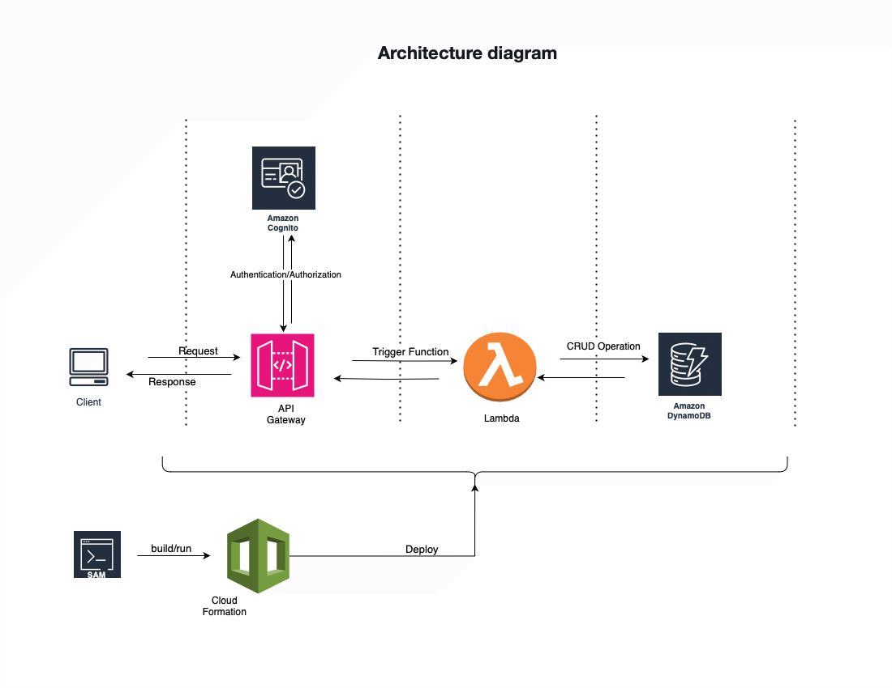

## Introduction
Note taking app was built using following AWS resource
1. Cognito
2. API Gateway
3. Lambda
4. DynamoDB


##API Gateway endPoints

| Operation on endPoint | Description                                   |
|-----------------------|-----------------------------------------------|
| GET    /note          | Retrieves all notes of the authenticated user |
| GET    /note/{noteId} | Retrieves single note                         |
| DELETE /note/{noteId} | Deletes note based on note id                 |
| POST   /note          | Add/Update node                               |


## User signup
New user are able to sign up using AWS Cognito sign in page

##Authentication
User are able to sign in using aws cognito login page


## Access token
Access token are required to make calls to the apigateway endpoints.
Authentication/Authorization is enforced at the apigateway endpoints using OAuth2 with Grant type flow as Authorization code. For testing purpose 
one can run provided postman collections to  generate access token and test the endpoints. 


### Testing
Use Postman collection to test the api.

### Build and deploy
AWS SAM CLI is used to build and run the serverless application. To install SAM CLI follow this link.https://docs.aws.amazon.com/serverless-application-model/latest/developerguide/install-sam-cli.html
SAM uses template.yaml. This file contains all the resource and configuration to build and deploy the application.

1. Run build command to build all the resource specified in template.yaml
```shell
sam build
```
2.Run deploy to deploy the app using  cloud formation
```shell
sam deploy --guided
```


## Postman Collection: NoteAPI.postman_collection.json


## Architecture Diagram:diagram.png



